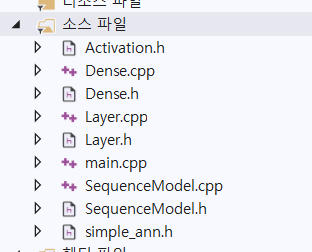

# AND/OR classifier의 모듈화 in C++


어제 만든 classifier는 한 파일에 모든 것이 모아져 있었고, 모듈화 되지 않았습니다.

즉, 객체지향이 아니었기 때문에 모델을 확장하는 것에 한계가 있었습니다.


그래서 오늘은 main함수를 다음과 같이 재구성 했습니다.

```c++
#include<iostream>
#include<vector>
#include<cstdio>
#include<cmath>

#include "SequenceModel.h"
#include "Dense.h"


int main()
{
	// config
	constexpr int INPUT_SIZE = 2;

	// make model
	rulu::SequenceModel model;
	model.appendLayer(new rulu::Input(INPUT_SIZE)); // input size=2
	model.appendLayer(new rulu::Dense()); // currently add only one dense node.
	model.summary();
	model.loadData();
	model.train(1.f); // learning rate 1.0

	// inference
	float arr[] = { 0.f, 0.f };
	std::cout << "predict : " << model.predict(arr) << std::endl;

	float arr[] = { 0.f, 1.f };
	std::cout << "predict : " << model.predict(arr) << std::endl;

	float arr[] = { 1.f, 0.f };
	std::cout << "predict : " << model.predict(arr) << std::endl;

	float arr[] = { 1.f, 1.f };
	std::cout << "predict : " << model.predict(arr) << std::endl;

	return 0;
}
```

또한, 각 파일들의 내용은 모듈로 분리해서 작성하고 있습니다.

전과 같이 전역적으로 사용할 수 있는 변수들이 줄었기 때문에, 좀 더 생각할 부분이 있는 듯 합니다.




### 어제 짰던, 절차지향적 코드

```c++
#include<iostream>
#include<vector>
#include<cstdio>
#include<cmath>

int main()
{
	std::vector<float> inputs;
	inputs.resize(2);

	std::vector<float> weights;
	weights.resize(2);

	float outputPredicted=0;

	float loss = 0;

	float bias = 0;

	float output = 0;

	float learningRate = 1.f;

	float dataset[4][3] = {
		{0, 0, 0},
		{0, 1, 1},
		{1, 0, 1},
		{1, 1, 1},
	};

	constexpr int INPUT_SIZE = 2;

	// initialize variables
	std::srand(0);
	for (auto& weight : weights)
	{
		weight = (float)std::rand() / RAND_MAX;
	}
	bias = (float)std::rand() / RAND_MAX;
	
	// train
	std::cout << "[train]" << std::endl;
	for (int epochs = 0; epochs < 100; ++epochs)
	{
		std::vector<float> weightsUpdate;
		weightsUpdate.resize(2);

		float biasUpdate = 0;
		std::cout << "==============[" << epochs + 1 << "] epochs============" << std::endl;
		for (const auto& data : dataset)
		{
			// forward

			// 1. 데이터 load
			inputs[0] = data[0];
			inputs[1] = data[1];
			output = data[2];

			// weigted sum
			float sum = 0;
			for (int i = 0; i < INPUT_SIZE; ++i)
			{
				sum += inputs[i] * weights[i];
			}
			sum += bias;

			std::vector<float> dSumWeights;
			dSumWeights.resize(2);
			dSumWeights[0] = inputs[0];
			dSumWeights[1] = inputs[1];

			float dSumBias = 1;

			// activate
			outputPredicted = 1.f / (1.f + exp(sum)); // sigmoid

			float dOutputPredictedSum = -1.f / pow(1.f + exp(sum), 2) * exp(sum);

			// calculate loss
			loss = 1.f / 2.f * pow(outputPredicted - output, 2); // mse

			float dLossOutputPredicted = outputPredicted - output;

			// print
			/*std::cout << "input&output : " << inputs[0] << ", " << inputs[1] << " => " << output << std::endl;
			std::cout << "FC layer : " << weights[0] << ", " << weights[1] << std::endl;
			std::cout << "  bias : " << bias << std::endl;
			std::cout << "output: " << output << ", predicted: " << (outputPredicted > 0.5f) << std::endl;*/
			std::cout << "loss : " << loss << std::endl;

			// backward
			for (int i = 0; i < weights.size(); ++i)
			{
				weightsUpdate[i] += dLossOutputPredicted * dOutputPredictedSum * dSumWeights[i];
			}
			biasUpdate += dLossOutputPredicted * dOutputPredictedSum * dSumBias;
		}
		for (int i = 0; i < weights.size(); ++i)
		{
			weights[i] -= learningRate*weightsUpdate[i];
		}
		bias -= learningRate*biasUpdate;
	}

	// inference
	std::cout << "\n\n[inference]" << std::endl;
	float sum = 0;
	float activated = 0;
	int predict = 0;

	inputs[0] = 0;
	inputs[1] = 0;

	sum = inputs[0] * weights[0] + inputs[1] * weights[1] + bias;
	
	activated = 1.f / (1.f + exp(sum));
	predict = activated > 0.5f;
	std::cout << inputs[0] << ", " << inputs[1] << " => " << predict << std::endl;

	inputs[0] = 0;
	inputs[1] = 1;

	sum = inputs[0] * weights[0] + inputs[1] * weights[1] + bias;

	activated = 1.f / (1.f + exp(sum));
	predict = activated > 0.5f;
	std::cout << inputs[0] << ", " << inputs[1] << " => " << predict << std::endl;

	inputs[0] = 1;
	inputs[1] = 0;

	sum = inputs[0] * weights[0] + inputs[1] * weights[1] + bias;

	activated = 1.f / (1.f + exp(sum));
	predict = activated > 0.5f;
	std::cout << inputs[0] << ", " << inputs[1] << " => " << predict << std::endl;
	
	inputs[0] = 1;
	inputs[1] = 1;

	sum = inputs[0] * weights[0] + inputs[1] * weights[1] + bias;

	activated = 1.f / (1.f + exp(sum));
	predict = activated > 0.5f;
	std::cout << inputs[0] << ", " << inputs[1] << " => " << predict << std::endl;

	return 0;
}
```


### insight

확실히 객체지향적으로 짜니,

겉으로 드러나는 부분이 깔끔하게 변경되어서,

라이브러리를 작성하지 않은 사람도 쉽게 변경 가능할 것 같습니다.

(하지만 아직 작동되지는 않는 상태입니다.)