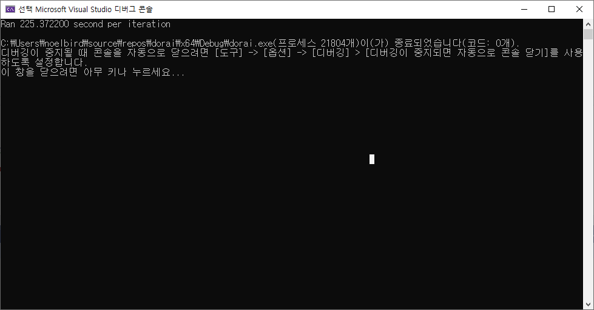
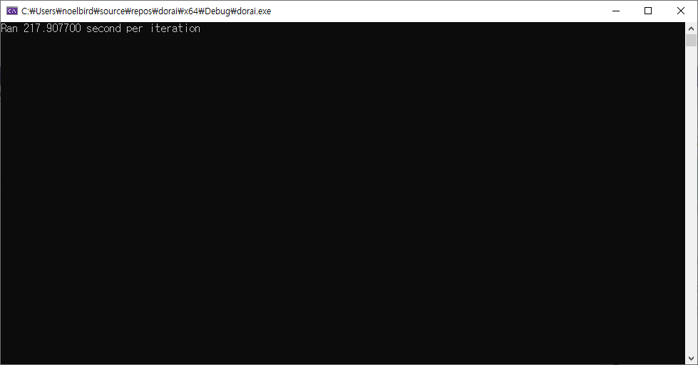

# feed-forward network


## 오늘 한 작업

- [x] fully-connected layer를 구성

- [x] feed-forward network를 구성

  ```c++
  void test_network()
  {
      // network의 타입 지정
      Network* net = new Network(11);
      net->setTypes(0, LAYER_TYPE::CONVOLUTIONAL);
      net->setTypes(1, LAYER_TYPE::MAXPOOL);
      net->setTypes(2, LAYER_TYPE::CONVOLUTIONAL);
      net->setTypes(3, LAYER_TYPE::MAXPOOL);
      net->setTypes(4, LAYER_TYPE::CONVOLUTIONAL);
      net->setTypes(5, LAYER_TYPE::CONVOLUTIONAL);
      net->setTypes(6, LAYER_TYPE::CONVOLUTIONAL);
      net->setTypes(7, LAYER_TYPE::MAXPOOL);
      net->setTypes(8, LAYER_TYPE::CONNECTED);
      net->setTypes(9, LAYER_TYPE::CONNECTED);
      net->setTypes(10, LAYER_TYPE::CONNECTED);
  
      // input 이미지 설정
      Image* dog = new Image();
      dog->loadFromFile("images/test_hinton.jpg");
  
      // 각 레이어별 세팅
      int n = 48;
      int stride = 4;
      int size = 11;
      ConvolutionalLayer* cl = new ConvolutionalLayer(dog->getHeight(), dog->getWidth(), dog->getChannel(), n, size, stride);
      MaxpoolLayer* ml = new MaxpoolLayer(cl->getOutput()->getHeight(), cl->getOutput()->getWidth(), cl->getOutput()->getChannel(), 2);
  
      n = 128;
      size = 5;
      stride = 1;
      ConvolutionalLayer* cl2 = new ConvolutionalLayer(ml->getOutput()->getHeight(), ml->getOutput()->getWidth(), ml->getOutput()->getChannel(), n, size, stride);
      MaxpoolLayer* ml2 = new MaxpoolLayer(cl2->getOutput()->getHeight(), cl2->getOutput()->getWidth(), cl2->getOutput()->getChannel(), 2);
  
      n = 192;
      size = 3;
      ConvolutionalLayer* cl3 = new ConvolutionalLayer(ml2->getOutput()->getHeight(), ml2->getOutput()->getWidth(), ml2->getOutput()->getChannel(), n, size, stride);
      ConvolutionalLayer* cl4 = new ConvolutionalLayer(cl3->getOutput()->getHeight(), cl3->getOutput()->getWidth(), cl3->getOutput()->getChannel(), n, size, stride);
      n = 128;
      ConvolutionalLayer* cl5 = new ConvolutionalLayer(cl4->getOutput()->getHeight(), cl4->getOutput()->getWidth(), cl4->getOutput()->getChannel(), n, size, stride);
      MaxpoolLayer* ml3 = new MaxpoolLayer(cl5->getOutput()->getHeight(), cl5->getOutput()->getWidth(), cl5->getOutput()->getChannel(), 4);
      ConnectedLayer* nl = new ConnectedLayer(ml3->getOutput()->getHeight() * ml3->getOutput()->getWidth() * ml3->getOutput()->getChannel(), 4096);
      ConnectedLayer* nl2 = new ConnectedLayer(4096, 4096);
      ConnectedLayer* nl3 = new ConnectedLayer(4096, 1000);
  
      net->setLayers(0, cl);
      net->setLayers(1, ml);
      net->setLayers(2, cl2);
      net->setLayers(3, ml2);
      net->setLayers(4, cl3);
      net->setLayers(5, cl4);
      net->setLayers(6, cl5);
      net->setLayers(7, ml3);
      net->setLayers(8, nl);
      net->setLayers(9, nl2);
      net->setLayers(10, nl3);
  
      // feed-forward 계산
      clock_t start = clock(), end;
      for (int i = 0; i < 10; ++i) {
          net->run(dog);
          dog->rotate();
      }
      end = clock();
      printf("Ran %lf second per iteration\n", (double)(end - start) / CLOCKS_PER_SEC / 10);
  
      net->getImage()->showImageLayers("Test Network Layer");
  }
  ```

  




- yolo 코드에서는 컴파일 할 때 Makefile에서 fast-math라는 옵션을 주고 있습니다. 연산을 좀 더 빨리할 수 있게 도와주는 옵션인 것 같습니다. stackoverflow에는 다음과 같이 설명이 된 자료가 있습니다.

  ```text
  // https://stackoverflow.com/questions/7420665/what-does-gccs-ffast-math-actually-do
  
  -ffast-math does a lot more than just break strict IEEE compliance.
  
  First of all, of course, it does break strict IEEE compliance, allowing e.g. the reordering of instructions to something which is mathematically the same (ideally) but not exactly the same in floating point.
  
  Second, it disables setting errno after single-instruction math functions, which means avoiding a write to a thread-local variable (this can make a 100% difference for those functions on some architectures).
  
  Third, it makes the assumption that all math is finite, which means that no checks for NaN (or zero) are made in place where they would have detrimental effects. It is simply assumed that this isn't going to happen.
  
  Fourth, it enables reciprocal approximations for division and reciprocal square root.
  
  Further, it disables signed zero (code assumes signed zero does not exist, even if the target supports it) and rounding math, which enables among other things constant folding at compile-time.
  
  Last, it generates code that assumes that no hardware interrupts can happen due to signalling/trapping math (that is, if these cannot be disabled on the target architecture and consequently do happen, they will not be handled).
  ```

  - 연산 순서 reordering(수학적으로는 같지만, floating point계산으로는 결과 값이 약간 다를 수 있음)
  - `errno` 라는 것을 disable 시킴. 이걸 disable 시키면, thread-local variable에 값을 쓰지 않습니다.
  - 모든 수학 연산을 `finite`하다고 가정함. NaN(또는 zero) 체크를 하지 않음
  - 제곱근에 대해서 역연산을 enable 시킴
  - `signed zero` 를 disable시킴
  - 하드웨어 인터럽트가 일어날 수 없다고 가정함. 하드웨어 인터럽트가 일어나게 된다면, 하드웨어에 대한 인터럽트를 처리하지 않음

- visual studio(2019)에는 fast-math 옵션이 없기 때문에, 가장 비슷한 부동소수점 옵션을 precise -> fast로 세팅했습니다.

- 한 번 model을 실행할 때마다, 약 250초 정도가 소요되었는데, 대부분의 시간이 convolutional layer에서 소요되었습니다.

- 가장 시간이 많인 걸린 것은 픽셀을 가져오는 연산이 시간을 많이 차지했습니다. 메모리 IO에서 시간을 많이 차지한 것 같고 개선해야 할 듯 합니다.

  

- visual studio에서 부동소수점 옵션(FP)을 precise -> fast로 세팅후 한 iteration 당 225 -> 217 초로 감소하였습니다.



## 앞으로 진행할 작업

- backpropagation
- 성능 개선
  - Image::getPixel함수 수정
  - Image::getPixelExtended함수 수정