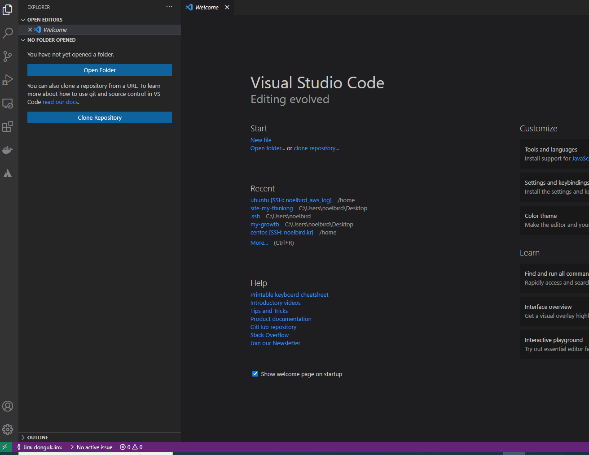
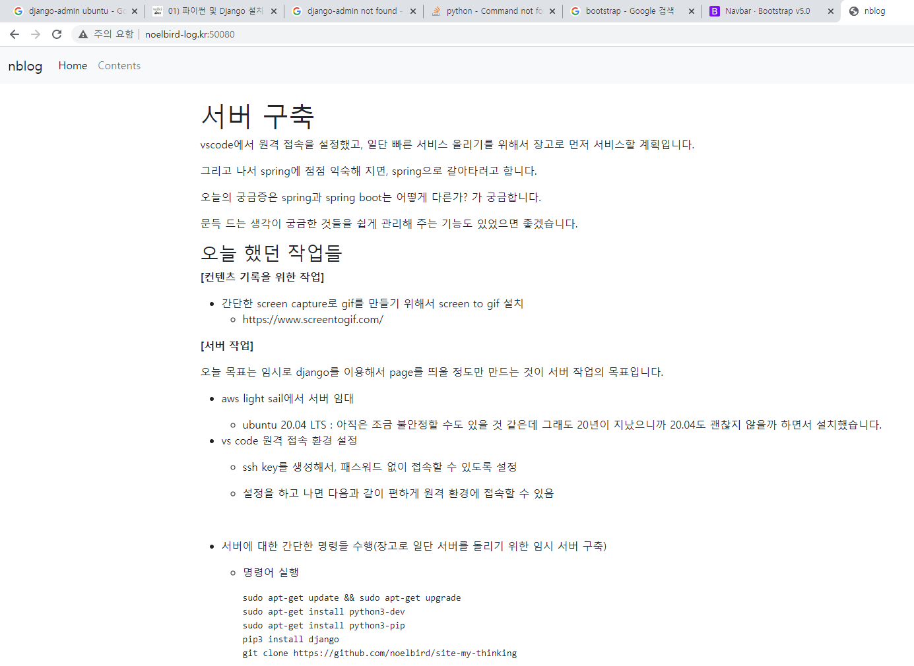

# 서버 구축


vscode에서 원격 접속을 설정했고, 일단 빠른 서비스 올리기를 위해서 장고로 먼저 서비스할 계획입니다.

그리고 나서 spring에 점점 익숙해 지면, spring으로 갈아타려고 합니다.


오늘의 궁금증은 spring과 spring boot는 어떻게 다른가? 가 궁금합니다.

문득 드는 생각이 궁금한 것들을 쉽게 관리해 주는 기능도 있었으면 좋겠습니다.


### 오늘 했던 작업들

(TODO: 작업한 시간들을 기록하는 기능이 있으면 좋을 것 같습니다)

- 컨텐츠 기록을 위한 작업(10min)
- 서버 작업(3h)
- C++로 배우는 딥러닝 공부(3h): 대부분의 시간을 cuda C++ 환경설정에 썼음...


### 앞으로 할 작업들

- TODO 컬렉터 만들기
  - 작업을 하다가 갑자기 떠오르는 생각들이 있는데, 그걸 별도의 곳에다가 적지말고 왜 그런 생각이 들었는지를 다시 떠올릴 수 있게, 작업하는 곳에서 그대로 적으면 좋겠습니다.
  - 오늘은 수동 TODO 컬렉터가 작동합니다. :happy:
  - 오늘의 수동 TODO 컬렉터
    - 작업관리: 작업한 시간들을 기록하는 기능 만들기(jira or python으로)
    - 서버작업: google analytics 붙이기
    - 서버작업: markdown에서 코드 작성했을 때, html로 렌더링 하면 *Syntax HighLighter* 적용되어서 렌더링 되면 좋겠음


**[컨텐츠 기록을 위한 작업]**

- 간단한 screen capture로 gif를 만들기 위해서 screen to gif 설치
  - https://www.screentogif.com/


**[서버 작업]**

오늘 목표는 임시로 django를 이용해서 page를 띄울 정도만 만드는 것이 서버 작업의 목표입니다.

- aws light sail에서 서버 임대

  - ubuntu 20.04 LTS : 아직은 조금 불안정할 수도 있을 것 같은데 그래도 20년이 지났으니까 20.04도 괜찮지 않을까 하면서 설치했습니다.

- vs code 원격 접속 환경 설정

  - ssh key를 생성해서, 패스워드 없이 접속할 수 있도록 설정

  - 설정을 하고 나면 다음과 같이 편하게 원격 환경에 접속할 수 있음

    

- 서버에 대한 간단한 명령들 수행(장고로 일단 서버를 돌리기 위한 임시 서버 구축)

  - 명령어 실행

    ```bash
    sudo apt-get update && sudo apt-get upgrade
    sudo apt-get install python3-dev
    sudo apt-get install python3-pip
    pip3 install django
    git clone https://github.com/noelbird/site-my-thinking
    ```

  - 이후, django 작업 내용

  - 오늘까지 django 작업한 것

    - 만만한 bootstrap 적용
    - django로 대략적인 layout 잡아봤음(기록이 어느정도 가능한 정도로만 만들고, 이후에 spring으로 아예 넘어갈 것)
    - markdown renderer 적용: mistune 2.0.0rc1
    - 아직까지 컨텐츠들 리스트를 보여주는 목록은 없음
    - markdown의 이미지 정상적으로 보여지지 않음

    

- server를 외부노출 시키기 위해 방화벽 해제

  - 80포트는 외부에서 자꾸 접속 시도를 하기 때문에 50080으로 임시로 뚫어놨습니다.

    

- wappalyzer 설치

  - wappalyzer는 다른 사이트의 개발 스택을 파악할 수 있는 도구입니다.
  - 다른 사이트들을 돌아다니면서, 괜찮은 스택을 가지고 있으면 참고하기 위해서 설치했습니다.
    - gabia: google analytics와 Element UI를 사용하고 있네요. Element UI는 vue에서 사용하는 UI Library인 것 같습니다. 혹시나 나중에 vue를 사용하게 된다면 깔끔하기 때문에 참고할만 할 것 같습니다.

- intelliJ 설치 완료(spring kotlin으로 서버를 구축하기 위해서 환경 세팅)


**[서버 작업 - TODO]**

- google analytics 붙이기


**[C++로 배우는 딥러닝 공부]**

교재: 성안당 - C++로 배우는 딥러닝 1판


### Chapter 01. 딥러닝 개요

##### p. 15 map

- map에 관한 생각

  - 책에 나와 있는 예시 코드 - map에 대한 소개를 하는 코드입니다.

    ```c++
    // example.cpp
    Graph *g = new Graph();
    map<string, Graph *> m;
    m["variable1"] = g; // 키-값을 지정해서 삽입
    Graph *g2 = m["variable1"]; // 키로 참조
    ```

  - 책에는 map이라는 C++ STL container를 사용하고 있습니다. 하지만 map은 tree구조로 되어 있고, unordered_map이 hash로 구현되어 있기 때문에, 아이템의 개수가 많아지면 많아질 수록 map이 unordered_map에 비해서 성능이 떨어질 것이기 때문에 조금 아쉽습니다. unordered_map에 대한 소개는 없네요


##### p. 18 트리구조

- 책에 있는 예시 코드

  ```c++
  // [코드1.9] main.cpp
  #include<iostream>
  #include<stdio.h>
  #include<vector>
  #include<memory>
  
  using namespace std;
  
  class Function;
  
  class Variable {
      public:
      float a = 0;
      Function *creator = NULL;
      
      Variable(float a){
          this->a = a;
      }
  };
  
  using PVariable = shared_ptr<Variable>;
  
  class Function{
      public:
      vector<PVariable> v;
      
      PVariable forward(PVariable v1, PVariable v2) {
          v.push_back(v1);
          v.push_back(v2);
          
          PVariable pv = PVariable(new Variable(0));
          pv->creator = this;
          pv->a += v1->a;
          pv->a += v2->a;
          
          return pv;
      }
  }
  
  PVariable forward(PVariable v1){
      v.push_back(v1);
      
      PVariable pv = PVariable(new Variable(0));
      pv->creator = this;
      pv->a += v1->a;
      
      return pv;
  }
  
  void traverse(PVariable v){
      cout <<v->a <<endl;
      
      Function *f = v->creator;
      if (f==NULL)return;
      for(int i=0; i<f->v.size();i++){
          traverse(f->v[i]);
      }
  }
  
  int main(void){
      PVariable v1 = PVariable(new Variable(1));
      PVariable v2 = PVariable(new Variable(2));
      Function *f1 = new Function();
      Function *f2 = new Function();
      Function *f3 = new Function();
      
      PVariable r1 = f1->forward(v1, v2);
      PVariable r2 = f2->forward(r1);
      PVariable r3 = f3->forward(r2);
      
      traverse(r3);
      
      return 0;
  }
  ```

  (TODO: markdown에서 코드 작성했을 때, html로 렌더링 하면 *Syntax HighLighter* 적용되어서 렌더링 되면 좋겠음)

  (TODO: TODO가 많아서 todo를 관리하는 방법이 도입되면 좋겠음. jira에서 관리 하거나 그냥 관리하는 툴을 만들거나..)

- 이 코드에 대한 내 생각

  - `using PVariable = shared_ptr<Variable>;` 부분 -  **shared_ptr 구현에서 weak ptr로 해야 메모리 누수가 없을 것**

    - 주로 이 부분에는 예전에 공부했던 C++을 복습하면서 봤습니다.(POCU teachable 참조)

    - **중요한 점은 shared_ptr을 사용할 때는 다른 클래스에서 멤버 변수로 shared_ptr을 가지고 있을 때, 클래스 간의 순환 참조를 주의해야 한다는 점입니다.** 하나는 weak_ptr을 사용해서 멤버 변수로 가지고 있어야 순환참조에 의한 메모리 누수가 일어나지 않습니다.

    - shared_ptr는 내부적으로 두 개의 포인터를 소유하고 있습니다(데이터(원시) 포인터, 제어블록을 가리키는 포인터).

    - shared_ptr는 unique_ptr와는 달리 포인터를 다른 shared_ptr와 공유할 수 있습니다.

    - 참조 카운팅 기반으로 동작함

    - 원시 포인터는 어떠한 shared_ptr에게도 참조되지 않을 때 소멸됨

    - shared_ptr을 사용하려면, `#include <memory>`를 해줘야 했던 걸로 기억하고 있습니다. 그래서 윗쪽에서 memory를 인클루드한 것 같습니다.

    - PVariable을 사용하지 않고, shared_ptr을 만들고자 한다면, 다음과 같은 코드를 사용할 수 있습니다. (예전에 공부했던 C++ 복습차원)

      ```c++
      std::shared_ptr<Variable> vector = std::make_shared<Variable>(0.0f);
      ```

    - 만약 아래와 같이 포인터를 공유하게 되면, strong refs 카운트가 늘어나게 되고, weak_refs 카운트는 늘어나지 않습니다. (잘 못된 사용법)

      ```c++
      std::shared_ptr<Variable> vector = std::make_shared<Variable>(0.0f);
      std::shared_ptr<Variable> copiedVector = vector;
      ```

    - 아래의 명령어로 vector를 비울 수 있습니다. 

      ```c++
      vector.reset() // vector = null; 과 같음. 참조 카운트가 1이 줄어듦
      ```

    - 아래의 명령어로 참조 횟수를 확인할 수 있습니다.

      ```c++
      long number = vector.use_count();
      ```


### Chapter 02. 신경망을 위한 행렬 연산과 병렬 프로그래밍

#### 2.1. GPU 활용하기


##### p.25 병렬 프로그래밍의 중요성

> 처리의 병렬화는 신경망과 직접 관련된 기술은 아닙니다...(중략)
>
> 물론 인프라적인 부분은 블랙박스화되어 있으니 몰라도 상관없다고 하는 사람도 있습니다. 하지만, 기초를 이해하지 않은 채 도구를 사용하면, 뜻밖의 장벽에 부닥칠 가능성이 높아지는 것은 부정할 수 없습니다. 예상 밖의 일이 발생했을 때 어떻게 대처할 수 있을지는 응용력에 달렸습니다. 또 완전히 새로운 뭔가를 만들어 내는 힘도 탄탄히 쌓인 기초에서 나오는 응용력에 달렸다고 생각합니다.

저자가 말한 것처럼 인프라적인 부분은 딥러닝과 직접적인 관련이 없다고 말할 수도 있겠지만, inference 속도 최적화 부분에서는 반드시 필요한 부분이기 때문에 중요하다고 생각합니다.

그리고 탄탄히 쌓인 기초에서 완전히 새로운 뭔가를 만들어내는 힘이 생긴다고 하는 것에는 완전히 동감합니다.


- 책에서 사용하는 환경
  - CPU: 인텔 코어 i7
  - 메모리: 16GB
  - GPU: 엔비디아 타이탄 X
  - OS: 리눅스(우분투 16.04)
  - CUDA 툴킷버전: 8.0

- 실습 환경 세팅(집에 있는 데스크탑)
  - CPU: AMD Ryzen 5 5600X 6-Core (12 CPUs, ~3.7GHz)
  - 메모리: 32GB
  - OS: windows 10
  - GPU: nvidia RTX 3070 (memory 8GB)
  - CUDA 툴킷 버전: 11.0


#### 2-2. CUDA 프로그래밍

##### p.28 CUDA 커널

- CUDA 커널이란 실행의 최소단위를 정의하는 함수입니다. CUDA 커널에 정의된 내용을 복수의 스레드가 동시에 실행합니다.

- 예제 코드

  ```c++
  // [코드 2.2] kernel_sample.cpp
  
  // 커널 정의
  __global__ void MatAdd(float A[N][N], float B[N][N], float C[N][N])
  {
      int i = threadIdx.x;
      int j = threadIdx.y;
      C[i][j] = A[i][j] + B[i][j];
  }
  
  int main()
  {
      float *A, *B, *C;
      int N = 100;
      cudaMalloc((void**)&A, N*N*sizeof(float));
      cudaMalloc((void**)&B, N*N*sizeof(float));
      cudaMalloc((void**)&C, N*N*sizeof(float));
      float *a = malloc(N*N*sizeof(float));
      float *b = malloc(N*N*sizeof(float));
      float *c = malloc(N*N*sizeof(float));
      cudaMemcpy(A, a, N*N*sizeof(*A), cudaMemcpyHostTodevice);
      cudaMemcpy(B, b, N*N*sizeof(*B), cudaMemcpyHostTodevice);
      
      // N * N * 1threads의 한 블록과 함께 실행되는 커널 인보케이션
      int numBlocks = 1;
      dim3 threadsPerBlock(N, N);
      MatAdd<<<numblocks, threadsPerBloc >>>(A, B, C);
      
      cudaMemcpy(c, C, N*N*sizeof(*C), cudaMemcpyHostToDevice);
      
      cudaFree(A); cudaFree(B); cudaFree(C);
  }
  ```

  

- 위의 코드를 컴파일하기 위해서, visual studio 2019를 설치했습니다(vs code 아님).
  
  - C++ 데스크톱 개발 기능
- 저는 위의 실습 환경을 visual studio에서 cmake를 사용해서 환경 설정을 한 다음, visual studio로 빌드를 하도록 할 예정입니다.
  - 생각보다 설치가 쉽게 되지 않았습니다.
  - visual studio를 설치한 후에 cuda를 설치하면 될 것 같기도 하고...
  - 아래의 블로그를 참고해서 다음에 해볼 계획입니다.
  - https://velog.io/@springkim/CUDA-CUDA-8.09.0-Visual-Studio-2015-%EC%84%A4%EC%A0%95