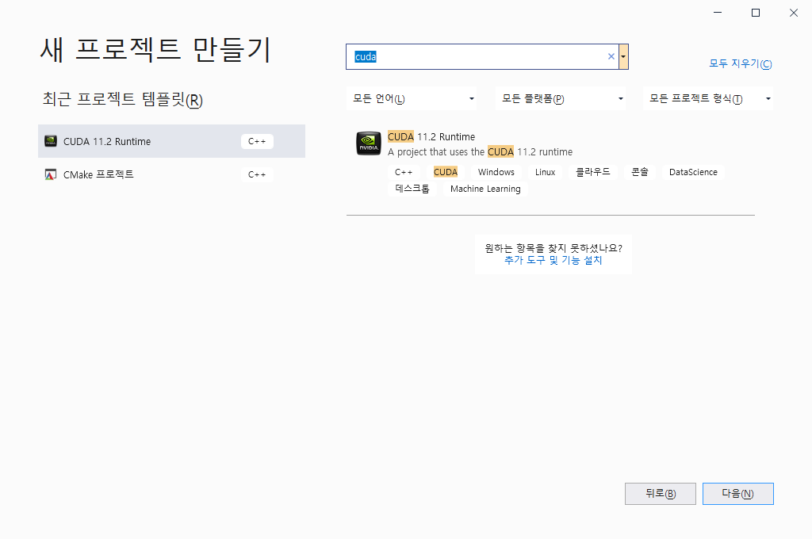
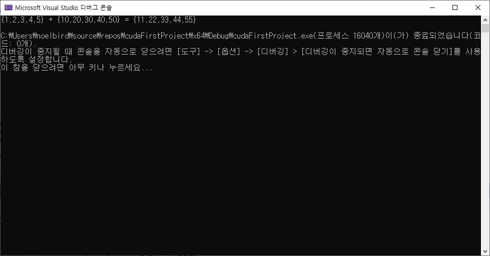

# easy setting for cuda programming


## 1. 환경

OS: windows 10

IDE: visual studio 2019

CUDA Toolkit: 11.2


IDE와 CUDA를 설치한 후에 visual studio 2019를 시작 할 때

새 프로젝트를 만들고, 프로젝트 형식에서 cuda를 검색하면 CUDA 11.2 Runtime이 나옵니다.





위의 프로젝트를 선택해서 실행하면, 곧 바로 빌드할 수 있습니다.

기본적으로 제공되는 소스코드와 결과는 다음과 같습니다.


```c++
// kernel.cu

#include "cuda_runtime.h"
#include "device_launch_parameters.h"

#include <stdio.h>

cudaError_t addWithCuda(int *c, const int *a, const int *b, unsigned int size);

__global__ void addKernel(int *c, const int *a, const int *b)
{
    int i = threadIdx.x;
    c[i] = a[i] + b[i];
}

int main()
{
    const int arraySize = 5;
    const int a[arraySize] = { 1, 2, 3, 4, 5 };
    const int b[arraySize] = { 10, 20, 30, 40, 50 };
    int c[arraySize] = { 0 };

    // Add vectors in parallel.
    cudaError_t cudaStatus = addWithCuda(c, a, b, arraySize);
    if (cudaStatus != cudaSuccess) {
        fprintf(stderr, "addWithCuda failed!");
        return 1;
    }

    printf("{1,2,3,4,5} + {10,20,30,40,50} = {%d,%d,%d,%d,%d}\n",
        c[0], c[1], c[2], c[3], c[4]);

    // cudaDeviceReset must be called before exiting in order for profiling and
    // tracing tools such as Nsight and Visual Profiler to show complete traces.
    cudaStatus = cudaDeviceReset();
    if (cudaStatus != cudaSuccess) {
        fprintf(stderr, "cudaDeviceReset failed!");
        return 1;
    }

    return 0;
}

// Helper function for using CUDA to add vectors in parallel.
cudaError_t addWithCuda(int *c, const int *a, const int *b, unsigned int size)
{
    int *dev_a = 0;
    int *dev_b = 0;
    int *dev_c = 0;
    cudaError_t cudaStatus;

    // Choose which GPU to run on, change this on a multi-GPU system.
    cudaStatus = cudaSetDevice(0);
    if (cudaStatus != cudaSuccess) {
        fprintf(stderr, "cudaSetDevice failed!  Do you have a CUDA-capable GPU installed?");
        goto Error;
    }

    // Allocate GPU buffers for three vectors (two input, one output)    .
    cudaStatus = cudaMalloc((void**)&dev_c, size * sizeof(int));
    if (cudaStatus != cudaSuccess) {
        fprintf(stderr, "cudaMalloc failed!");
        goto Error;
    }

    cudaStatus = cudaMalloc((void**)&dev_a, size * sizeof(int));
    if (cudaStatus != cudaSuccess) {
        fprintf(stderr, "cudaMalloc failed!");
        goto Error;
    }

    cudaStatus = cudaMalloc((void**)&dev_b, size * sizeof(int));
    if (cudaStatus != cudaSuccess) {
        fprintf(stderr, "cudaMalloc failed!");
        goto Error;
    }

    // Copy input vectors from host memory to GPU buffers.
    cudaStatus = cudaMemcpy(dev_a, a, size * sizeof(int), cudaMemcpyHostToDevice);
    if (cudaStatus != cudaSuccess) {
        fprintf(stderr, "cudaMemcpy failed!");
        goto Error;
    }

    cudaStatus = cudaMemcpy(dev_b, b, size * sizeof(int), cudaMemcpyHostToDevice);
    if (cudaStatus != cudaSuccess) {
        fprintf(stderr, "cudaMemcpy failed!");
        goto Error;
    }

    // Launch a kernel on the GPU with one thread for each element.
    addKernel<<<1, size>>>(dev_c, dev_a, dev_b);

    // Check for any errors launching the kernel
    cudaStatus = cudaGetLastError();
    if (cudaStatus != cudaSuccess) {
        fprintf(stderr, "addKernel launch failed: %s\n", cudaGetErrorString(cudaStatus));
        goto Error;
    }
    
    // cudaDeviceSynchronize waits for the kernel to finish, and returns
    // any errors encountered during the launch.
    cudaStatus = cudaDeviceSynchronize();
    if (cudaStatus != cudaSuccess) {
        fprintf(stderr, "cudaDeviceSynchronize returned error code %d after launching addKernel!\n", cudaStatus);
        goto Error;
    }

    // Copy output vector from GPU buffer to host memory.
    cudaStatus = cudaMemcpy(c, dev_c, size * sizeof(int), cudaMemcpyDeviceToHost);
    if (cudaStatus != cudaSuccess) {
        fprintf(stderr, "cudaMemcpy failed!");
        goto Error;
    }

Error:
    cudaFree(dev_c);
    cudaFree(dev_a);
    cudaFree(dev_b);
    
    return cudaStatus;
}

```


코드에서 goto문을 사용한 다는 것이 꽤 충격적이네요..

공식 예제인데 goto문을 사용할 생각을 하다니...

결과는 다음과 같이 나옵니다.



