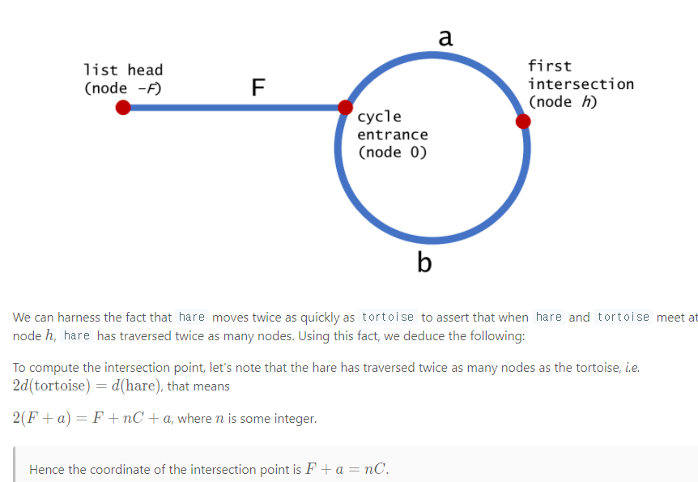

# Leet code - 1214 two-pointer-technique


> #### Floyd's Tortoise and Hare

cycle의 유무와 cycle이 시작되는 지점을 찾는 알고리즘

특징으로는 memory를 O(1)만에 어떤 지점에서 cycle이 시작되는지 찾을 수 있습니다.


hare: 속도가 빠른 runner

tortoise: 속도가 느린 거북이

hare는 거북이보다 2배 빠른 속도로 움직인다고 하고, haere와 거북이가 만나게 된다면 cycle이 있는 것입니다.

그 만난 지점에서 거북이만 원점으로 다시 되돌리고, hare가 거북이와 같은 속도로 움직이도록 했을 때,

다시 만난 지점이 cycle의 시작 위치입니다.

(솔직히 이해는 잘 안 됨)




=== "my code"

    ```c++
    /**
     * Definition for singly-linked list.
     * struct ListNode {
     *     int val;
     *     ListNode *next;
     *     ListNode(int x) : val(x), next(NULL) {}
     * };
     */
    class Solution {
    public:
        ListNode *detectCycle(ListNode *head) {
            if(head==nullptr)
                return nullptr;
            if(head->next == nullptr || head->next->next == nullptr)
                return nullptr;
            // find isCycle
            int isFirst=true;
            ListNode* ptrFast=head;
            ListNode* ptrSlow=head;
            
            while(1)
            {
                if(ptrFast->next==nullptr||ptrFast->next->next==nullptr)
                    return nullptr;
                if(ptrSlow==ptrFast && !isFirst)
                    break;
                ptrSlow=ptrSlow->next;
                ptrFast=ptrFast->next->next;
                isFirst=false;
            }
            printf("here\n");
            ptrSlow = head;
            while(1)
            {
                if(ptrFast==ptrSlow)
                    return ptrSlow;
                ptrSlow=ptrSlow->next;
                ptrFast=ptrFast->next;
            }
        }
    };
    ```

