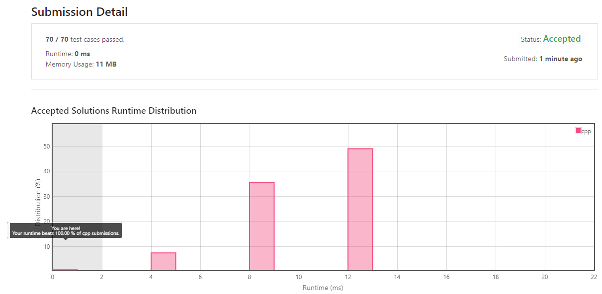

# 오늘은 leet code를 두 문제 풀었습니다


## leet code: 1207 - Remove Linked List Elements


=== "실행시간(상위 59.52%), 메모리(상위 26.07%)"

```c++
/**
 * Definition for singly-linked list.
 * struct ListNode {
 *     int val;
 *     ListNode *next;
 *     ListNode() : val(0), next(nullptr) {}
 *     ListNode(int x) : val(x), next(nullptr) {}
 *     ListNode(int x, ListNode *next) : val(x), next(next) {}
 * };
 */
class Solution {
public:
    ListNode* removeElements(ListNode* head, int val) {
        ListNode* newHead = new ListNode();
        newHead->next = head;
        ListNode* n1 = newHead;
        ListNode* n2 = newHead->next;

        while (n2 != nullptr)
        {
            if (n2->val == val)
            {
                n1->next = n2->next;
                n2 = n1->next;
            }
            else
            {
                n1 = n1->next;
                if (n1 != nullptr)
                    n2 = n1->next;
            }
        }
        return newHead->next;
    }
};
```


## leet code: 1208 - Odd Even Linked List





=== "runtime 상위 0%, memory 상위 100%"

    ```c++
    /**
     * Definition for singly-linked list.
     * struct ListNode {
     *     int val;
     *     ListNode *next;
     *     ListNode() : val(0), next(nullptr) {}
     *     ListNode(int x) : val(x), next(nullptr) {}
     *     ListNode(int x, ListNode *next) : val(x), next(next) {}
     * };
     */
    class Solution {
    public:
        ListNode* oddEvenList(ListNode* head) {
            ListNode* head1 = new ListNode();
            ListNode* head2 = new ListNode();
    
            ListNode* ptr1 = head1;
            ListNode* ptr2 = head2;
    
            int cnt=0;
            while(head!=nullptr)
            {
                if(cnt%2==0)
                {
                    ptr1->next = new ListNode(head->val);
                    ptr1 = ptr1->next;
                }else
                {
                    ptr2->next = new ListNode(head->val);
                    ptr2 = ptr2->next;
                }
                head = head->next;
                cnt++;
            }
            ptr1->next = head2->next;
            return head1->next;
    
        }
    };
    ```


