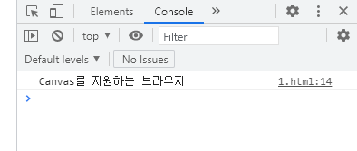
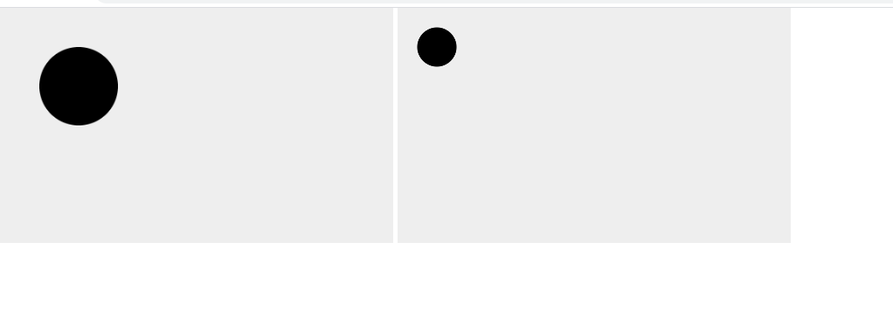
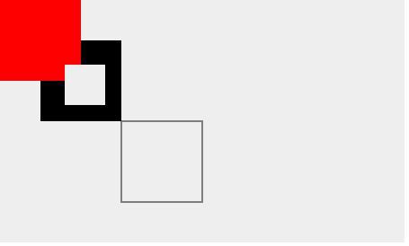
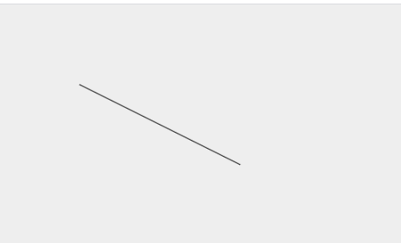
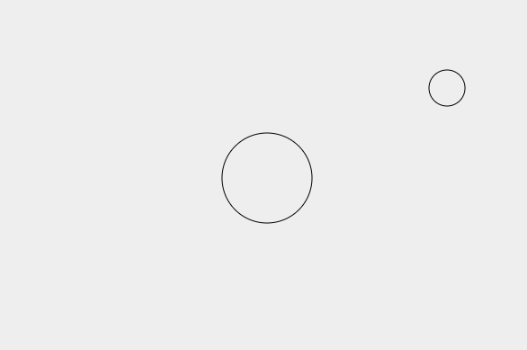
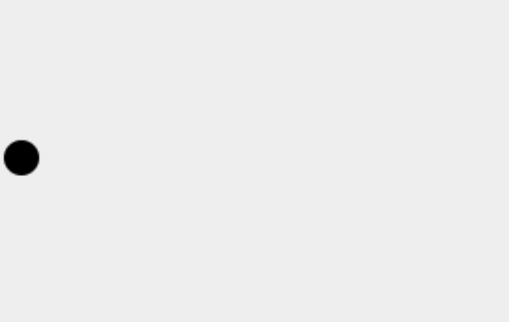

# day 1: canvas 시작


## 1. canvas 지원 확인



저는 강의와 다르게 CDN으로 modernizr로 실행했습니다.

```html
<!DOCTYPE html>
<html lang="en">
<head>
    <meta charset="UTF-8">
    <meta http-equiv="X-UA-Compatible" content="IE=edge">
    <meta name="viewport" content="width=device-width, initial-scale=1.0">
    <title>Document</title>
</head>
<body>
    <script src="https://cdnjs.cloudflare.com/ajax/libs/modernizr/2.8.3/modernizr.min.js" integrity="sha512-3n19xznO0ubPpSwYCRRBgHh63DrV+bdZfHK52b1esvId4GsfwStQNPJFjeQos2h3JwCmZl0/LgLxSKMAI55hgw==" crossorigin="anonymous" referrerpolicy="no-referrer"></script>
    <script>
        if(Modernizr.canvas)
        {
            console.log("Canvas를 지원하는 브라우저")
        }
    </script>
</body>
</html>
```


## 2. 캔버스 사이즈 설정



캔버스의 사이즈를 설정하는 부분은 두 부분이 있음

html의 property에서 설정(width, height)

css에서 설정(width, height)


- 고해상도 이미지를 얻는 방법
  - html의 property에서 이미지 사이즈 설정
  - css에서 width, height를 줄여버리기
  - 크게 만든 다음에 사이즈를 1/2로 줄여버리면 해상도가 좋음


```html
<!DOCTYPE html>
<html lang="en">
<head>
    <meta charset="UTF-8">
    <meta http-equiv="X-UA-Compatible" content="IE=edge">
    <meta name="viewport" content="width=device-width, initial-scale=1.0">
    <title>Document</title>
    <style>
        * {
            background: #fff;
        }
        body {
            margin: 0;
        }
        .canvas {
            width: 500px;
            height: 300px;
            background: #eee;
        }
    </style>
</head>
<body>
    <canvas class="canvas" id="canvas" width="500" height="300">이 브라우저는 캔버스를 지원하지 않습니다.</canvas>
    <canvas class="canvas" id="canvas2" width="1000" height="600"></canvas>
    <script>
        const canvas1 = document.querySelector('#canvas');
        const cnavas2 = document.querySelector('#canvas2');
        const context = canvas1.getContext('2d');
        const context2 = canvas2.getContext('2d');

        context.arc(100, 100, 50, 0, Math.PI*2, false);
        context2.arc(100, 100, 50, 0, Math.PI*2, false);
        context.fill();
        context2.fill();
    </script>
</body>
</html>
```


## 3. 색칠하기



canvas는 그냥 그림으로 생각하는 것이 좋습니다.


```html
<!DOCTYPE html>
<html lang="en">
<head>
    <meta charset="UTF-8">
    <meta http-equiv="X-UA-Compatible" content="IE=edge">
    <meta name="viewport" content="width=device-width, initial-scale=1.0">
    <title>Document</title>
    <style>
        body {
            margin: 0;
        }
        .canvas {
            width: 500px;
            height: 300px;
            background: #eee;
        }
    </style>
</head>
<body>
    <canvas class="canvas" id="canvas" width="500" height="300">이 브라우저는 캔버스를 지원하지 않습니다.</canvas>
    <script>
        // fillRect
        // clearRect
        // strokeRect
        const canvas = document.querySelector('.canvas');
        const context = canvas.getContext('2d');

        context.fillRect(50, 50, 100, 100);
        context.fillStyle = 'red';
        context.fillRect(0, 0, 100, 100);
        context.clearRect(80, 80, 50, 50);
        context.strokeRect(150, 150, 100, 100);
    </script>
</body>
</html>
```


## 4. 선 긋기



```html
<!DOCTYPE html>
<html lang="en">
<head>
    <meta charset="UTF-8">
    <meta http-equiv="X-UA-Compatible" content="IE=edge">
    <meta name="viewport" content="width=device-width, initial-scale=1.0">
    <title>Document</title>
    <style>
        body {
            margin: 0;
        }
        .canvas {
            width: 500px;
            height: 300px;
            background: #eee;
        }
    </style>
</head>
<body>
    <canvas class="canvas" id="canvas" width="500" height="300">이 브라우저는 캔버스를 지원하지 않습니다.</canvas>
    <script>
        // fillRect
        // clearRect
        // strokeRect
        const canvas = document.querySelector('.canvas');
        const context = canvas.getContext('2d');

        context.beginPath();
        context.moveTo(100, 100);
        context.lineTo(300, 200);
        context.stroke();
        context.fill();
    </script>
</body>
</html>
```


선을 그릴 거면, stroke

색을 채울 거면, fill


## 5. 원 그리기



원 그리기는 없고, 호(arc)를 이용해서 그려야 합니다.

```html
<!DOCTYPE html>
<html lang="en">
<head>
    <meta charset="UTF-8">
    <meta http-equiv="X-UA-Compatible" content="IE=edge">
    <meta name="viewport" content="width=device-width, initial-scale=1.0">
    <title>Document</title>
    <style>
        body {
            margin: 0;
        }
        .canvas {
            background: #eee;
        }
    </style>
</head>
<body>
    <canvas class="canvas" id="canvas" width="600" height="400">이 브라우저는 캔버스를 지원하지 않습니다.</canvas>
    <script>
        function radian(degree){
            return degree * Math.PI / 180;
        }
        // fillRect
        // clearRect
        // strokeRect
        const canvas = document.querySelector('.canvas');
        const context = canvas.getContext('2d');

        context.beginPath();
        context.arc(300, 200, 50, 0, radian(360), false);
        context.stroke();
        context.closePath();
        
        context.beginPath();
        // 마지막 boolean 인자는 시계방향으로 그릴지, 반 시계방향으로 그릴지
        context.arc(500, 100, 20, 0, radian(360), false);
        context.stroke();
        context.closePath();
    </script>
</body>
</html>
```

위에서 beginPath, closePath를 안 해주고 stroke()를 해주면, 선들이 연결됩니다.


## 6. 애니메이션

## 

```html
<!DOCTYPE html>
<html lang="en">
<head>
    <meta charset="UTF-8">
    <meta http-equiv="X-UA-Compatible" content="IE=edge">
    <meta name="viewport" content="width=device-width, initial-scale=1.0">
    <title>Document</title>
    <style>
        body {
            margin: 0;
        }
        .canvas {
            background: #eee;
        }
    </style>
</head>
<body>
    <canvas class="canvas" id="canvas" width="500" height="300">이 브라우저는 캔버스를 지원하지 않습니다.</canvas>
    <script>
        const canvas = document.querySelector('.canvas');
        const context = canvas.getContext('2d');
        let xPos = 10;

        function draw(){
            context.clearRect(0, 0, canvas.width, canvas.height);
            context.beginPath();
            context.arc(xPos, 150, 10, 0, Math.PI*2);
            context.fill();
            context.closePath();
            xPos += 1;

            window.requestAnimationFrame(draw); // 60분의 1초를 목표로 계속 그림
        }
        draw();
        
    </script>
</body>
</html>
```


## 궁금한 점

vscode에서는 자동으로 js로 코딩할 때 getContext 등의 함수가 자동으로 나오지 않았습니다. 어떤 방법을 적용해야 intelli sense 기능이 활성화 될까요..?