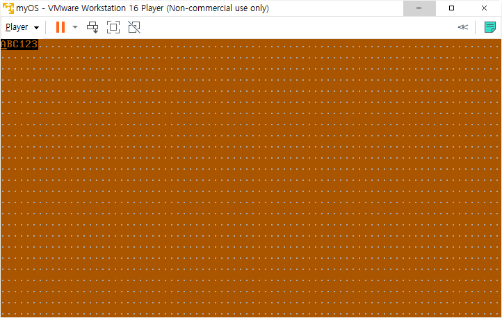
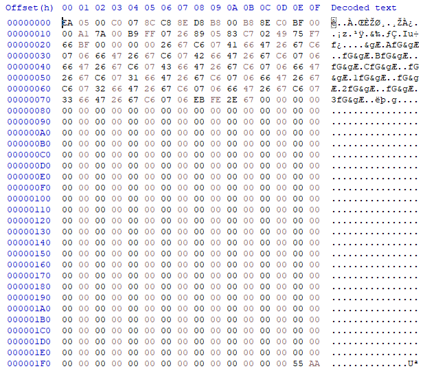
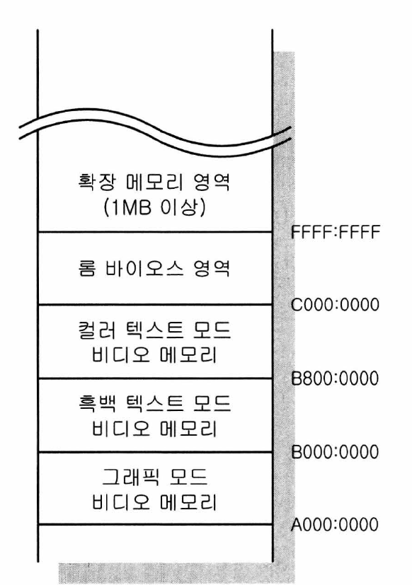

# day 01: bootstrap


## 오늘의 결과물




## 환경설정

- HOST OS: windows 10
- vmware workstation player 설치
  - 처음에는 windows에 내장된 hyper-v를 사용하려고 했지만, hyper-v에는 플로피 디스크를 사용하려고 할 때 VFD라는 가상 플로피디스크를 만들어 줘야 했습니다. 이렇게 되면, FAT32 파일 시스템까지 구현하고 그 안에 bootstrap을 넣어야 했기 때문에 hyper-v 대신에 vmware workstation을 선택했습니다.
- 어셈블리: nasm 설치
  - masm, tasm도 있지만 이것들은 windows에 국한되는 assembly라서 제외했습니다
- hex editor: hxd 설치
  - 010 editor에 비해 무료이고 가볍기 때문에 hxd를 설치했습니다.


## 코드(nasm assembly code, IA-32 syntax)

아래의 프로그램은 부팅이 되면서

BIOS가 플로피디스크의 MBR(첫 512바이트)에 들어있는 바이너리를 읽어들여서

램의 물리주소 0x7c00번지에 복사한 후, 0x7c00 번지로 점프합니다.

바이오스가 점프할 때 0x0000:7C00 방식으로 점프했기 때문에 CPU에 의해 자동적으로

CS(코드 세그먼트) 레지스터에는 0x0000이, IP 레지스터에는 0x7c00이 들어가 있는 상태입니다.

CS, DS, ES 등의 세그먼트 레지스터에 값을 넣을 때는 꼭 AX, BX 등 범용 레지스터를 거쳐서 값을 넣어야 합니다.(그대로 대입하면 컴파일 도중 에러가 발생합니다. 이유는 해당 opcode가 없어서 그렇지 않을까 싶습니다.)

```assembly
; bootstrap.asm


[org 0]             ; 메모리 내 초기 로딩 위치
[bits 16]           ; 타겟 프로세서의 모드를 지정 - https://www.nasm.us/xdoc/2.10.09/html/nasmdoc6.html
    jmp 0x07c0:start    ; far jump(CS:IP)
    					; 0x07c0은 가상 메모리 주소인데, 물리 메모리 주소는 0x07c00이고, 이걸 바꿔주는 역할은 CPU의 MMU가 해줍니다.
						; real mode에서의 가상 메모리 계산 방식은 SEGMENT*0x10(left bitshift 4번) + OFFSET 입니다.
						; protected mode에서는 동작방식이 다릅니다.
start:
    mov ax, cs          ; cs에는 0x07C0이 들어가 있습니다.
    mov ds, ax          ; ds를 cs와 같게 해줍니다.

    mov ax, 0xB800      ; 비디오 메모리의 세그먼트를
    mov es, ax          ; es 레지스터에 넣습니다.
    mov di, 0           ; 제일 윗줄의 처음에 쓸 것이라고 알림
    mov ax, word [msgBack]  ; 써야 할 데이터의 주소 값을 지정
    mov cx, 0x7FF       ; 화면 전체에 쓰기 위해서는
                        ; 0x7FF(10진수 2047)개의 WORD가 필요합니다.

paint:
    mov word [es:di], ax    ; 비디오 메모리에 씁니다.
    add di, 2               ; 한 WORD를 썼으므로 2를 더합니다.
    dec cx                  ; 한 WORD를 썼으므로 CX의 값을 하나 줄입니다.
    jnz paint               ; CX가 0이 아니면 paint로 점프하여 나머지를 더 씁니다.

    mov edi, 0              ; 제일 윗줄의 처음에 쓸 것이라고 지정
    mov byte [es:edi], 'A'  ; 비디오 메모리에 write
    inc edi                 ; 한 개의 BYTE를 썼으므로 1을 더합니다.
    mov byte [es:edi], 0x06 ; 배경색을 write
    inc edi                 ; 한 개의 BYTE를 썼으므로 1을 더합니다.
    mov byte [es:edi], 'B'
    inc edi
    mov byte [es:edi], 0x06
    inc edi
    mov byte [es:edi], 'C'
    inc edi
    mov byte [es:edi], 0x06
    inc edi
    mov byte [es:edi], '1'
    inc edi
    mov byte [es:edi], 0x06
    inc edi
    mov byte [es:edi], '2'
    inc edi
    mov byte [es:edi], 0x06
    inc edi
    mov byte [es:edi], '3'
    inc edi
    mov byte [es:edi], 0x06
    jmp $                       ; 이 번지에서 무한루프를 돕니다.

msgBack db '.', 0x67            ; 배경색으로 사용할 데이터

times 510-($-$$) db 0           ; 여기에서 509번지까지 0으로 채웁니다.
dw 0xAA55                       ; 510번지에 0x55를, 511번지에 0xAA를 넣어둡니다.
                                ; 0xAA55는 부팅 가능한 것을 알리는 역할을 합니다.
                                ; 0xAA55는 510~511번지에 들어 있어야 합니다.
```


위의 코드를 기계어로 변환하는 명령어는 다음과 같습니다.

```bash
nasm -o bootstrap.img bootstrap.asm
```


- 바이너리



- 디스어셈블된 코드
  - 명령어: `ndisasm -b16 bootstrap.img`

```assembly
; disassembly
00000000  EA0500C007        jmp 0x7c0:0x5
00000005  8CC8              mov ax,cs
00000007  8ED8              mov ds,ax
00000009  B800B8            mov ax,0xb800
0000000C  8EC0              mov es,ax
0000000E  BF0000            mov di,0x0
00000011  A17A00            mov ax,[0x7a]
00000014  B9FF07            mov cx,0x7ff
00000017  268905            mov [es:di],ax
0000001A  83C702            add di,byte +0x2
0000001D  49                dec cx
0000001E  75F7              jnz 0x17
00000020  66BF00000000      mov edi,0x0
00000026  2667C60741        mov byte [es:edi],0x41
0000002B  6647              inc edi
0000002D  2667C60706        mov byte [es:edi],0x6
00000032  6647              inc edi
00000034  2667C60742        mov byte [es:edi],0x42
00000039  6647              inc edi
0000003B  2667C60706        mov byte [es:edi],0x6
00000040  6647              inc edi
00000042  2667C60743        mov byte [es:edi],0x43
00000047  6647              inc edi
00000049  2667C60706        mov byte [es:edi],0x6
0000004E  6647              inc edi
00000050  2667C60731        mov byte [es:edi],0x31
00000055  6647              inc edi
00000057  2667C60706        mov byte [es:edi],0x6
0000005C  6647              inc edi
0000005E  2667C60732        mov byte [es:edi],0x32
00000063  6647              inc edi
00000065  2667C60706        mov byte [es:edi],0x6
0000006A  6647              inc edi
0000006C  2667C60733        mov byte [es:edi],0x33
00000071  6647              inc edi
00000073  2667C60706        mov byte [es:edi],0x6
00000078  EBFE              jmp short 0x78
0000007A  2E670000          add [cs:eax],al
0000007E  0000              add [bx+si],al
00000080  0000              add [bx+si],al
00000082  0000              add [bx+si],al
00000084  0000              add [bx+si],al
00000086  0000              add [bx+si],al
00000088  0000              add [bx+si],al
; ... 생략 ...
000001EC  0000              add [bx+si],al
000001EE  0000              add [bx+si],al
000001F0  0000              add [bx+si],al
000001F2  0000              add [bx+si],al
000001F4  0000              add [bx+si],al
000001F6  0000              add [bx+si],al
000001F8  0000              add [bx+si],al
000001FA  0000              add [bx+si],al
000001FC  0000              add [bx+si],al
000001FE  55                push bp
000001FF  AA                stosb
```


- 글자를 찍을 때, 0xB800 라는 가상 메모리에 데이터를 넣는 이유
  - real mode에서 사용되는 특정한 주소가 있기 때문입니다. 컬러 텍스트 모드로 글자를 찍으려고 하면, B800 영역에 데이터를 넣어야 합니다.




- 비디오 메모리에 사용되는 값의 형식은 다음과 같습니다.

  

  배경색과 글자색 모두 4비트를 사용합니다.

  


## done

만들면서 배우는 OS 커널의 구조와 원리 chapter 1 완료