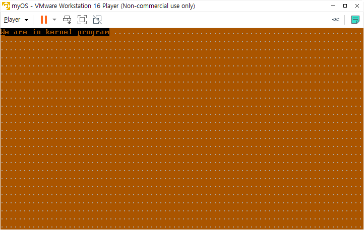
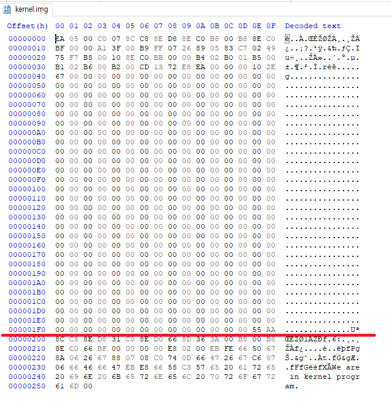
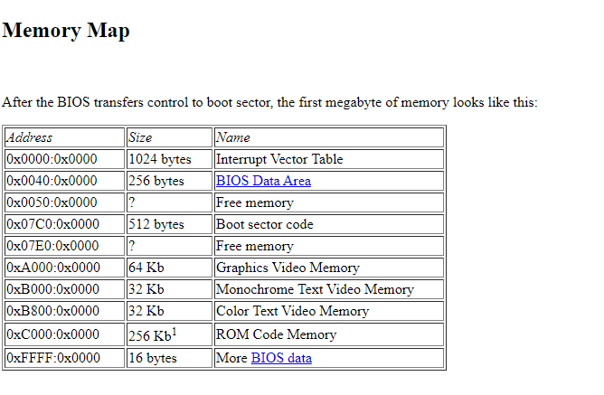

# day 02: bootloader 만들기


## 오늘 만든 결과물




## 소스코드


부트로더를 이용해서 커널로 점프한 후, 글자 출력

=== "bootloader.asm"

    ```assembly
    ; bootloader.asm
    [org 0]
        jmp 07C0h:start
    
    ; cs, ds, es 세그먼트를 초기화
    start:
        mov ax, cs;     BIOS에서 cs를 0, ip를 07c0으로 셋팅했음
        mov ds, ax
        mov es, ax
    
        mov ax, 0xB800
        mov es, ax  ; es에 비디오 메모리 영역을 넣음
        mov di, 0   ; destination index를 0으로 세팅
        mov ax, word [msgBack]
        mov cx, 0x7FF   ;2047
    
    paint:  ; 화면 전부를 .으로 찍음
        mov word [es:di], ax
        add di, 2
        dec cx
        jnz paint
    
    ; int 0x13 어느 섹터로 부터 몇 개의 섹터를 읽어라
    ; PARAMETERS
    ; AH	02h
    ; AL	Sectors To Read Count
    ; CH	Cylinder
    ; CL	Sector
    ; DH	Head
    ; DL	Drive
    ; ES:BX	Buffer Address Pointer
    
    ; RESULTS
    ; CF	Set On Error, Clear If No Error
    ; AH	Return Code
    ; AL	Actual Sectors Read Count
    
    ; 램의 0x1000번지로 ax를 복사하는 루틴
    read:
        mov ax, 0x1000  ; ES:BX = 1000:0000 ; 복사 목적지의 주소값
        mov es, ax
        mov bx, 0
    
        mov ah, 2   ; 디스크에 있는 데이터를 es:bx의 주소로
        mov al, 1   ; 1 섹터를 읽을 것이다; 플로피디스크의 한 섹터는 512byte
        mov ch, 0   ; 0번째 실린더
        mov cl, 2   ; 2번째 섹터부터 읽기 시작한다.
        mov dh, 0   ; Head=0
        mov dl, 0   ; Drive=0, A: 드라이브
        int 0x13    ; Read!
    
        jc read     ; 에러가 나면 다시 함; 에러 발생의 경우 flag 레지스터의 CF 플래그가 1로 세팅됨
    
        jmp 0x1000:0000 ; kernel.bin이 위치한 곳으로 점프한다.
    
    msgBack db '.', 0x67
    
    times 510-($-$$) db 0
    dw 0AA55h
    
    ```

=== "kernel.asm"


    ```assembly
    [org 0]
    [bits 16]
    
    start:
        mov ax, cs  ; CS에는 0x1000이 들어 있다.
        mov ds, ax
        xor ax, ax
        mov ss, ax  ; stack segment는 0으로 세팅
    
        lea esi, [msgKernel]    ; 문자열이 있는 곳의 주소를 구함
        mov ax, 0xB800
        mov es, ax              ; es에 0xB800을 넣는다
        mov edi, 0              ; 화면의 제일 처음 부분부터 시작할 것이다.
        call printf
        jmp $
    
    printf:
        push eax                ; 먼저 있던 eax 값을 스택에 보존해 놓는다.
    
    printf_loop:
        mov al, byte [esi]      ; esi가 가리키는 주소에서 문자를 하나 가져온다.
        mov byte [es:edi], al   ; 문자를 화면에 나타낸다.
        or al, al               ; al이 0인지를 알아본다.
        jz printf_end           ; 0이라면 print_end로 점프한다.
        inc edi                 ; 0이 아니라면 edi를 1 증가시켜
        mov byte [es:edi], 0x06 ; 문자색과 배경색의 값을 넣는다.
        inc esi                 ; 다음 문자를 꺼내기 위해 esi를 하나 증가시킨다.
        inc edi                 ; 화면에 다음 문자를 나타내기 위해 edi를 증가시킨다.
        jmp printf_loop         ; 루프를 돈다.
    
    printf_end:
        pop eax                 ; 스택에 보존했던 eax를 다시 꺼낸다.
        ret                     ; 호출한 부분으로 돌아간다.
    
    msgKernel db "We are in kernel program", 0
    
    ```


## 위의 소스코드를 입력한 후, binary를 합쳐서 이미지 만들기

```bash
nasm -f bin -o bootloader.bin src\bootloader.asm
nasm -f bin -o kernel.bin src\kernel.asm
copy bootloader.bin + kernel.bin /b kernel.img
```


## 바이너리 확인



만들어진 kernel.img 파일을 살펴보면, 512(=0x200)번째 offset부터 kernel.asm의 내용이 들어가 있는 것을 확인할 수 있습니다.

즉, kernel.img에서 하나의 섹터 사이즈는 512byte이기 때문에 위에서 0x13 번의 바이오스 콜을 했을 때,

두 번째 섹터를 읽으라고 하면 0x0200번째 offset에 있는 값을 읽어서 메모리로 복사합니다.

```assembly
; ... 생략 ...

read:
    mov ax, 0x1000  ; ES:BX = 1000:0000 ; 복사 목적지의 주소값
    mov es, ax
    mov bx, 0

    mov ah, 2   ; 디스크에 있는 데이터를 es:bx의 주소로
    mov al, 1   ; 1 섹터를 읽을 것이다; 플로피디스크의 한 섹터는 512byte
    mov ch, 0   ; 0번째 실린더
    mov cl, 2   ; 2번째 섹터부터 읽기 시작한다.
    mov dh, 0   ; Head=0
    mov dl, 0   ; Drive=0, A: 드라이브
    int 0x13    ; Read!

; ... 생략 ...
```


## 다른 클러스터를 읽는 BIOS interrupt call(0x13)

`int 0x13`에 서비스 넘버(02)를 AH에 넣어서 호출하면 `어느 섹터로 부터 몇 개의 섹터를 읽어라`  하는 의미가 됩니다.

참조: [위키피디아](https://en.wikipedia.org/wiki/INT_13H#INT_13h_AH=02h:_Read_Sectors_From_Drive)


[PARAMETERS]

- AH	02h
- AL	Sectors To Read Count
- CH	Cylinder
- CL	Sector - 한 섹터의 사이즈는 floppy disk의 경우 512byte입니다.
- DH	Head 
- DL	Drive - 플로피디스크인 A 드라이브는 0
- ES:BX	Buffer Address Pointer


[RESULTS]

- CF	Set On Error, Clear If No Error
- AH	Return Code
- AL	Actual Sectors Read Count


## kernel에서의 함수 호출

```assembly
; kernel.asm

; ... 생략 ...

start:
    mov ax, cs  ; CS에는 0x1000이 들어 있다.
    mov ds, ax
    xor ax, ax  ; ax를 0으로 세팅
    mov ss, ax  ; stack segment는 0으로 세팅

    lea esi, [msgKernel]    ; 문자열이 있는 곳의 주소를 구함
    mov ax, 0xB800
    mov es, ax              ; es에 0xB800을 넣는다
    mov edi, 0              ; 화면의 제일 처음 부분부터 시작할 것이다.
    call printf
    jmp $

; ... 생략 ...
```

위의 start 함수에서  stack segment를 0으로 초기화 후, printf 함수를 호출합니다.

stack을 메모리 주소 0번에다 설정을 했는데, 약간 위험한게 아닌가 하는 생각이 듭니다. 



http://staff.ustc.edu.cn/~xyfeng/research/cos/resources/machine/mem.htm


메모리 맵의 레이아웃에서 인터럽트 벡터 테이블을 덮어쓸 가능성이 있어 보입니다.

약간 이 부분은 의심스럽긴 하지만, 책 내용대로 그대로 따라갑니다.


## Done

챕터 2 - 커널을 로드한다 마무리