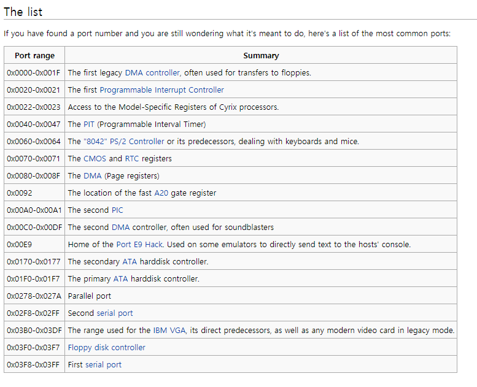
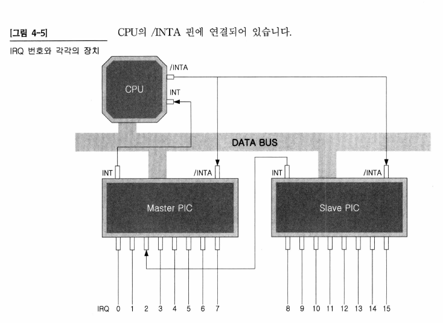
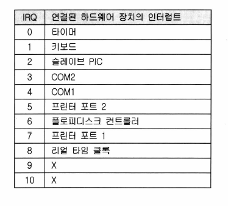
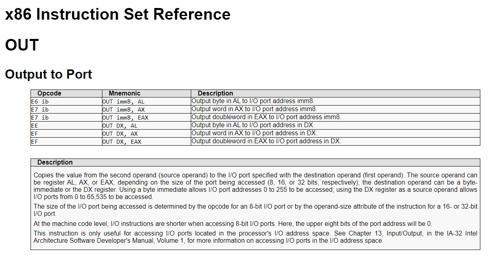

## PIC(Programmable Interrupt Controller)의 초기화 - 설명(1)


## 오늘의 결과물


## 설명

- INTEL i/o ports

  - i/o ports는 메모리와 주소공간을 공유합니다.

  - https://wiki.osdev.org/I/O_Ports

    - 아래의 표에서 PIC 는 0x20 ~ 0x21의 주소를 가지고 있습니다.
    - second PIC의 주소는 0xA0 ~ 0xA1의 주소를 가지고 있습니다.

    

- PIC의 비트의 의미

  - https://stackoverflow.com/questions/282983/setting-up-irq-mapping

    ```
    // PICM => master, PICS => slave
    outportb(0x20, 0x11); /* write ICW1 to PICM, we are gonna write commands to PICM */
    outportb(0xA0, 0x11); /* write ICW1 to PICS, we are gonna write commands to PICS */
    
    outportb(0x21, 0x20); /* remap PICM to 0x20 (32 decimal) */
    outportb(0xA1, 0x28); /* remap PICS to 0x28 (40 decimal) */
    
    outportb(0x21, 0x04); /* IRQ2 -> connection to slave */ 
    outportb(0xA1, 0x02);
    
    outportb(0x21, 0x01); /* write ICW4 to PICM, we are gonna write commands to PICM */
    outportb(0xA1, 0x01); /* write ICW4 to PICS, we are gonna write commands to PICS */
    
    outportb(0x21, 0x0); /* enable all IRQs on PICM */
    outportb(0xA1, 0x0); /* enable all IRQs on PICS */
    ```

- PIC 하드웨어

  - 하드웨어 인터럽트는 8259A라는 칩을 통해서 이뤄집니다. 이 8259A를 보통 PIC라고 부릅니다.

  - 이 PIC도 하나의 컨트롤러의 개념을 가지고 있어서 조그마한 프로그램을 넣어 조작할 수 있습니다. 이 프로그램에는 초기화, 여러 개의 PIC 연결 방법, 인터럽트를 받아들이는 방법, 받아들인 인터럽트에 대해 CPU에게 알려주는 방법 등이 기재되어 있어야 합니다.

  - 하나의 PIC는 8개의 IRQ 핀을 가지고 있습니다.

  - PIC 두 개가 마스터, 슬레이브로 연결되어 있고, 마스터의 INT 핀이 CPU의 INT핀으로 연결되어 있습니다. 슬레이브의 INT 핀은 마스터의 3번째 IRQ 핀인 2번 핀에 연결되어 있습니다. 그리고 두 PIC 모두 /INTA 핀이 CPU의 /INTA 핀에 연결되어 있습니다.

    

    

    


## 새롭게 알게된 어셈블리 명령어

- `out <source i/o port> <data source>`: 데이터를 i/o PORT로 카피합니다.

  

  https://c9x.me/x86/html/file_module_x86_id_222.html


## 오늘 한 것

P. 127 까지 학습