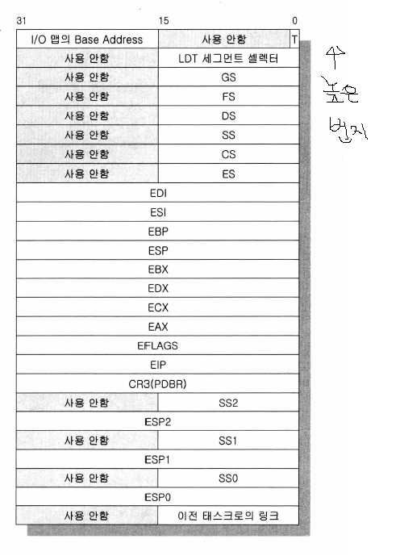
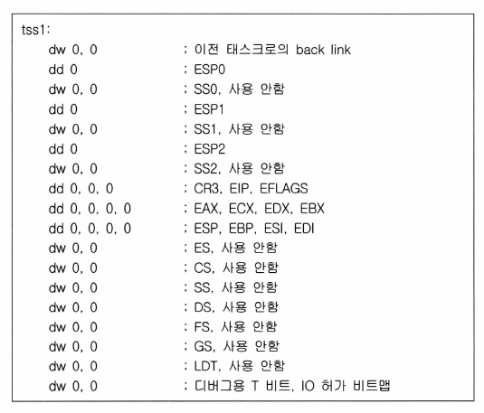
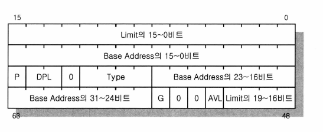

# day 13: Task Switching과 TSS

**Intel 80286 이상의 CPU**에서는 **Protected Mode**에서의 **Task switching을 CPU레벨에서 지원**해 줍니다.

우리는 먼저 CPU가 지원해 주는 기능을 사용한 태스크 스위칭 방식에 대해 배우고, 이후 현재 OS 커널들이 구현한 방식에 따라

CPU가 지원하는 방식을 사용하지 않고 태스크 스위칭을 하는 방법을 알아보겠습니다.

- **선점형 task switching 방식**
  - 프로그램이 수행되는 동안 **어떤 상황에 있든지 관계없이 그 프로그램을 일단 정지시키고, 다른 프로그램이 이전에 실행했던 곳부터 다시 실행**되도록 하는 방식입니다.
  - 이러한 구현을 위해서는 CPU에서 수행되는 프로그램의 모든 레지스터 값을 일단 보존 시키고, 이전에 수행되었다 저장되었던 프로그램의 모든 레지스터 값들을 CPU에 옮겨놓아, 멈추었던 부분부터 다시 재개하도록 해야 합니다.
  - task switching을 구현하기 위해서는 먼저 RAM상에 모든 레지스터 값들이 보존될 영역을 만들어 놓아야 합니다. 이 영역을 TSS(Task State Segment)라고 합니다.
  - 그리고 또 하나 이 TSS를 지정하는 TSS 디스크립터가 GDT에 지정되어 있어야 합니다.

TSS

TSS는 CPU의 거의 모든 레지스터 값들을 저장할 수 있게 되어 있습니다. GDTR, IDTR, CR0, CR2 등의 모든 태스크가 공통으로 사용하는 레지스터를 제외하고, 각 태스크가 사용하는 모든 레지스터를 포함하도록 되어 있습니다.

### TSS의 각 부분에 대한 자세한 설명

- **이전 태스크로의 back link**
  - 이전에 동작하던 프로그램의 TSS 영역의 세그먼트 셀렉터 값이 들어갑니다. TSS 영역은 GDT에 있는 TSS 세그먼트 디스크립터와 한 쌍을 이룹니다. 
  - JMP 명령은 해당되지 않으나, CALL 명령으로 태스크 스위칭을 하게 되면 다음 태스크는 자신의 TSS 영역에 이전 태스크이 TSS 디스크립터의 셀렉터 값을 저장해 두었다가 자신은 IRET 명령으로 프로그램을 마치고, 그러면 CPU는 현재 태스크의 TSS영역에서 "이전 태스크로의 back link" 값을 사용하여 이전 태스크로의 스위칭을 행하게 됩니다.
- **ESP0, SS0**
  - 유저 모드(레벨 3) 태스크가 실행 중 커널 모드(레벨 0)로 태스크 스위칭이 행해졌을 때 스택 값이 바뀌어야 합니다. 왜냐하면 유저 모드와 커널 모드에서 스택을 같이 사용한다면 프로그램의 실행이 엉키기도 할 뿐더러 유저 모드에서 커널 모드의 데이터를 읽고 쓰는 행위가 가능해지므로 커널의 보안 기능이 나빠지게 됩니다.
  - 그래서 TSS 영역에 ESP0, SS0, ESP1, SS1, ESP2, SS2와 같이 CPU가 사용하는 시스템 레벨별로 스택이 따로 존재하게 됩니다. 우리는 이 중 레벨 0와 레벨3만을 사용합니다.
  - ESP3, SS3은 없습니다. 유저 레벨 스택은 TSS의 ESP 칸과 SS 칸에 저장합니다.
- **디버그용 T 비트**
  - 유저 레벨 태스크를 디버깅할 때 브레이크 포인트를 걸어두고 한 스텝씩 진행시켜가며 프로그램의 동작을 확인해야 할 경우가 있습니다. 이 프로그램의 디버깅 중에도 다른 프로그램 과의 태스크 스위칭을 해야 하므로, 디버깅하고 있는 태스크가 태스크 스위칭되기 전에 이 태스크는 디버깅 중이었다는 표시를 이곳 T 비트에 해둡니다.
- **I/O 허가 비트맵**
  - 유저 레벨 태스크는 주변장치를 제멋대로 사용할 수 없습니다. I/O 허가 비트맵이라는 것으로 사용할 수 있는 I/O 장치와 사용할 수 없는 I/O 장치를 구분해야 합니다.
  - 이 또한 RAM의 한 영역에 표시해야 합니다. 이 표시해 둔 영역의 시작 주소를 TSS의 I/O 허가 비트맵 칸에 넣어둡니다.

## TSS 세그먼트 디스크립터

TSS 세그먼트 디스크립터

TSS 세그먼트 디스크립터는 TSS와 한 쌍을 이루고 있습니다.

이 디스크립터도 GDT에 들어가며, init.inc에서 보듯 이 TSS 디스크립터도 8바이트이므로 셀렉터 값이 8씩 건너뛰며 지정되어 있습니다.

Limit이 104(16진수 0x68)로 되어 있습니다. TSS 디스크립터에서는 이 Limit 값이 항상 0x67 이상의 값을 가지고 있어야 합니다. 그렇지 않으면 태스크 스위칭을 할 때 무효 TSS 예외(#TS)가 발생합니다. 0x68 이라고 알고 있으면 별로 문제될 것은 없습니다.

(https://www.intel.la/content/dam/www/public/us/en/documents/manuals/64-ia-32-architectures-software-developer-vol-3a-part-1-manual.pdf)

위의 intel manual을 참고하니,

0x67 이상이어야 하는 이유는 G비트(Granuality bit)가 0일 때, TSS descriptor의 사이즈보다 1 바이트 작은 값이기 때문입니다.  0x68(하나의 TSS)이 일반적으로 되면 되는 이유는 하나의 TSS descriptor가 0x68비트이기 때문입니다.

## 진도

p. 173까지 봤음

## 궁금한 점

- 왜 TSS 세그먼트 디스크립터도 GDT(Global Descriptor Table)에 넣는 거지? GDT는 각 메모리의 권한과 영역을 지정하는 공간이었던 것 같은데..?

- ltr ax 라는 어셈블리 명령어는 뭘까?

  => 저번시간에 load task register 라는 명령어를 배웠습니다(day 12참조). 이 명령어를 사용하면, GDT 또는 LDT 디스크립터에 들어있는 segment base와 limit을 참조해서, task register로 가져옵니다.