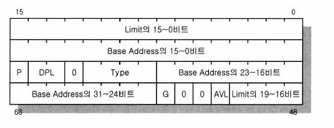
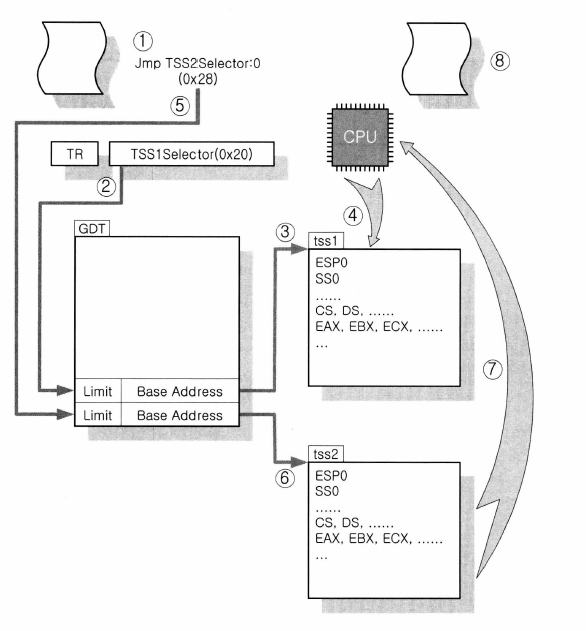

# day14: Task Switching (3)

### TSS 세그먼트 디스크립터

TSS 디스크립터도 GDT에 들어갑니다.

TSS 세그먼트 디스크립터에 포함된 Type 필드

TSS 디스크립터의 Type field에서는 1과 0으로 고정된 부분과 B 비트가 있습니다.

B비트는 현재 현재 이 태스크가 실행 중 혹은 실행을 기다리고 있는 중이라는 표시입니다.

CPU는 이 비트를 사용하여 실행 중 인터럽트가 걸린 태스크를 다시 CALL 했는지 아닌지를 검사합니다. 처음에는 0으로 클리어 해두면 됩니다.

소스코드의 descriptor4 부분에서 0x89를 대입해 보면 P 비트가 1, DPL이 00, 고정된 0, Type이 1001이라는 것을 알 수 있습니다. 태스크 스위칭은 항상 커널 레벨에서 이루어지도록 하는 것이 보통이므로 DPL은 00으로 해둡니다.

LTR 명령은 CPU에 있는 TR 레지스터에 TSS 디스크립터의 셀렉터 값을 넣는 명령어입니다.

## 태스크 스위칭 흐름도

1. ltr: TSS1Selector로 TSS1으로 실행
2. process2에서 "This is System Process 2" 출력
3. TSS2Selector
4. TSS1 selector:0로 점프(프로그램 처음부터 시작)
5.  . . .?

## 이해가 잘 안 되는 부분

전체 실행 흐름이 잘 이해가 안 됩니다 ㅠㅠ