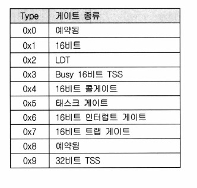
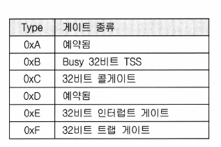

## day 16의 두 번째: 보호

Protected Mode로 넘어온 후에는 CPU는 각 명령어마다 아래와 같은 체크를 하고, 합당한 명령만 실행시키고, 합당하지 않다면 폴트를 발생시켜 커널이나 유저 프로그램이 자신이 이 에러를 다시 조정하도록 합니다.

- Limit 체크
- Type 체크
- 특권 레벨 체크
- 명령 세트 체크


## CPU의 체크 포인트

- Limit 체크

  - 세그먼트 디스크립터의 Limit은 프로그램 또는 프로세스가 세그먼트 외의 메모리 위치를 오프셋으로 지정하지 못하게 합니다.
  - 세그먼트 디스크립터 내의 G 비트가 0일 때에는 Limit을 0~0xFFFFF(1MB)까지 선택할 수 있습니다. 이 의미는 세그먼트 영역의 크기를 0으로 지정해도 되고, 0xFFFFF로 지정해도 된다는 뜻입니다.
  - 세그먼트 영역에서 유효 Limit은 전체 세그먼트 영역의 크기에서 1바이트를 뺀 것과 같습니다. 다음과 같은 경우 CPU는 일반 보호 예외(#GP)를 발생시킵니다.
    - 오프셋이 유효 Limit보다 큰 바이트
    - 오프셋이 유효 Limit-1바이트보다 큰 워드
    - 오프셋이 유효 Limit-3바이트보다 큰 더블워드
    - 오프셋이 유효 Limit-7바이트보다 큰 쿼드워드
  - Limit 체크는 발생했을 때 검출되기 때문에 원인을 잡아내기가 쉽습니다.
  - CPU는 세그먼트 영역의 Limit 체크와 더불어 GDT나 IDT 같은 테이블 그리고 TSS 영역의 크기도 체크합니다. 이는 GDT, IDT는 GDTR, IDTR의 6바이트(48비트) 중 2바이트(16비트)에 해당하는 Limit값을 사용하기도 하고, TSS는 TR 레지스터 6바이트 중 Limit을 나타내는 2바이트를 사용하여 Limit을 체크합니다.

- Type 체크

  - 세그먼트 디스크립터에는  S 비트와 Type 필드가 있습니다. S 비트가 0이면 Type 필드가 시스템 Type이라는 것이고, 1이면 코드나 데이터 세그먼트의 Type이라는 뜻입니다.

  - S비트가 0일 때의 타입

    

    

    - 예를 들어 P 비트가 1, DPL이 00, S가 0이고, 32비트 인트럽트 게이트라면 디스크립터의 한 부분에 0x8E가 들어가고, 32비트 TSS였다면 0x89가 들어가고, 32비트 TSS의 B비트가 1로 세팅되었을 때 0x8B가 됩니다.

  - 아래의 경우가 Type 체크되는 대표적인 예입니다.

    - 세그먼트 셀렉터가 세그먼트 레지스터에 로드될 때 CS에는 코드 세그먼트 셀렉터만이 로드될 수 있습니다.

      ```assembly
      MOV AX, 0x08
      MOV CS, AX
      ```

    - 디스크립터가 세그먼트 레지스터에 이미 로드되어 있는 세그먼트에 명령이 액세스 할 때

      - 코드 세그먼트 영역에는 데이터의 쓰기가 금지됩니다.
      - 읽기 전용 데이터 세그먼트에 데이터의 쓰기가 금지됩니다.
      - 코드 세그먼트 영역에 읽기 가능 플래그가 설정되지 않은 상태에서는 이 영역을 읽어들일 수 없습니다.

    - CALL JMP 명령의 오퍼랜드에 셀렉터가 있을 때 그 셀렉터에 대한 디스크립터의 Type 필드를 조사합니다.

      예를 들어 TSS 셀렉터를 오퍼랜드로 한 CALL JMP 명령에서는 그 셀렉터에 대한 디스크립터가 TSS용인지를 자동적으로 체크합니다. 또는 IRET 명령이 내려졌을 때 현재 실행 중인 태스크의 NT 비트가 1로 세팅되어 있으면 이에 대한 TSS 영역에서 "이전 태스크로의 백링크"가 TSS용인지를 체크합니다.

    - GDT의 맨 처음 디스크립터인 NULL 디스크립터를 CS나 SS에 로드하려고 할 때에는 일반 보호 예외(#GP)가 발생합니다.

      그리고 DS, ES, FS, GS에 로드는 가능하나 로드된 셀렉터를 사용하여 세그먼트 영역에 접근하려고 해도 일반 보호 예외(#GP)가 발생합니다.

- **특권 레벨**

  - CPU의 특권 레벨은 0~3으로 4개가 있습니다. 우리는 이 중 0과 3의 2개의 레벨만을 사용합니다. 낮은 레벨의 태스크가 높은 레벨의 데이터를 참조하려고 하면 일반 보호 에러(#GP)가 발생합니다.

  - 특권 레벨을 이해하기 위해서는 CPL, DPL, RPL 세 개의 레벨을 알아야 합니다.

  - **CPL(Current Privilege Level)**

    CPL은 현재 실행되고 있는 태스크의 특권 레벨로,  CS, SS 셀렉터 레지스터의 0, 1번째 비트에 있는 수입니다. 프로그램이 다른 특권 레벨의 코드 세그먼트로 제어 이행되면 CPU는 CPL을 변경합니다.

  - **DPL(Description Privilege Level)**

    위에서 CPL은 현재 CS, SS의 0, 1비트의 값이라고 했습니다. DPL은 디스크립터에 기재된 DPL 값이고 2비트로 표현됩니다. 디스크립터를 통한 세그먼트 영역으로의 모든 접근에서 항상 CPL과 DPL의 관계가 체크됩니다. 예를 들어 현재 낮은 레벨의 CPL을 가지고 있는데, 높은 레벨의 데이터 세그먼트 영역에 접근을 시도한다면 CS의 0, 1비트(CPL)와 세그먼트 디스크립터에 있는 DPL 값을 비교할 것입니다. 이러한 상황에서는 체크 후에 물론 불가능하다는 판단이 내려질 것입니다.

  - **RPL(Requested Privilege Level)**

    - 특권 레벨 3인 프로세스가 콜게이트(낮은 특권레벨에서 높은 특권 레벨의 루틴을 사용할 수 있게 하는 관문)을 통해 특권 레벨 0에 있는 루틴을 실행할 때가 있습니다. 이 때 일시적으로 특권 레벨 0으로 들어가기 때문에 특권 레벨 0의 데이터 영역에도 접근할 수 있습니다. 이러한 현상을 교묘히 이용하는 프로그램도 존재할 가능성이 있습니다. RPL 값은 이러한 상황을 막기 위해 OS 커널이 사용하는 값입니다. 예를 들어 콜게이트에 연결되어 있는 루틴에 이 루틴이 어디에서 불러졌는지를 기록하는 방법이 있습니다. 특권 레벨 3인 프로세스가 콜게이트를 통해 이 루틴을 불렀다면 데이터 세그먼트 셀렉터에 특권 레벨 3에서 불러졌다는 것을 표시합니다. RPL은 단어가 암시하는 바와 같이 누가 요구했는가를 나타내는 값입니다. 특권 레벨 3에서 불러졌다는 표시를 해두면 특권 레벨 0의 데이터는 건드리지 못할 것입니다. 그러나 특권 레벨 0에서 불러졌다면 OS 커널과 같은 레벨에서 불러졌기 때문에 특권 레벨 0의 데이터에 접근이 가능합니다. 

      콜게이트 이외의 대부분의 경우 RPL은 CPL과 같다고 보면 됩니다.

- 콜게이트

  - 


